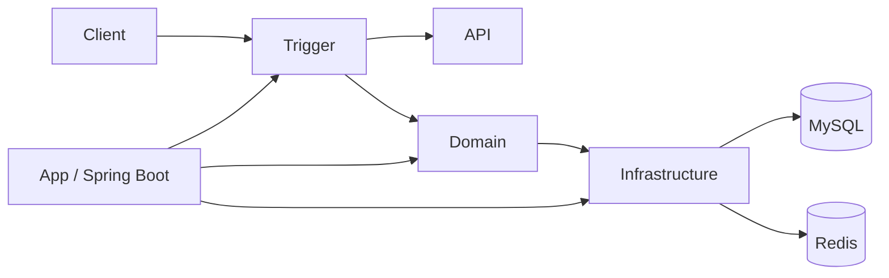

# GroupBuyMarket

基于 Spring Boot 的拼团营销系统示例项目，采用分层模块化设计实现拼团活动、优惠计算、人群标签、动态配置等核心能力。

## 项目简介

GroupBuyMarket 面向拼团营销场景，将业务能力拆分为 API、应用启动、领域模型、基础设施、触发器和公共类型等模块。项目重点展示拼团活动配置、优惠策略计算、规则节点编排、Redis 动态配置以及 MyBatis 数据访问等后端工程实践。

## 核心能力

- **拼团活动试算**：根据活动、商品和优惠配置计算最终支付价格。
- **多种优惠策略**：支持直减、满减、折扣、N 元购等优惠计算方式。
- **人群标签**：支持基于标签的人群范围控制与批量任务处理。
- **策略路由**：通过策略/节点方式组织营销规则执行链路。
- **动态配置**：基于 Redis Topic 实现运行期配置更新。
- **异步查询**：在线程池中并行加载活动配置与商品信息，降低串行查询开销。
- **模块化架构**：将领域逻辑、基础设施和接口触发层解耦，降低模块间耦合。

## 技术栈

- Java 8
- Spring Boot 2.7.x
- MyBatis
- MySQL 8
- Redis / Redisson
- HikariCP
- Lombok
- Maven
- Docker Compose

## 项目结构

```text
GroupBuyMarket
├── group-buy-market-api             # API 接口与响应模型
├── group-buy-market-app             # Spring Boot 启动、配置与资源文件
├── group-buy-market-domain          # 核心领域模型与业务规则
├── group-buy-market-infrastructure  # Repository、DAO、Redis 等基础设施实现
├── group-buy-market-trigger         # HTTP、任务等触发入口
├── group-buy-market-types           # 公共类型、异常与通用设计组件
├── docs/dev-ops                     # Docker、MySQL 初始化等部署文件
└── pom.xml                          # Maven 聚合工程
```

## 架构关系



## 快速开始

### 1. 环境要求

建议准备：

- JDK 8
- Maven 3.8+
- Docker / Docker Compose

### 2. 启动基础设施

```bash
cd docs/dev-ops

export MYSQL_ROOT_PASSWORD='your_mysql_password'
export REDIS_ADMIN_PASSWORD='your_redis_admin_password'

docker compose -f docker-compose-environment.yml up -d
```

默认端口：

| 服务 | 端口 |
| --- | ---: |
| MySQL | 13306 |
| Redis | 16379 |
| phpMyAdmin | 8899 |
| Redis Commander | 8081 |

### 3. 配置应用

开发环境支持通过环境变量覆盖数据库和 Redis 配置：

```bash
export DB_HOST=localhost
export DB_PORT=13306
export DB_NAME=group_buy_market
export DB_USERNAME=root
export DB_PASSWORD='your_mysql_password'
export REDIS_HOST=localhost
export REDIS_PORT=16379
```

不要将真实账号、密码、Token 或生产环境地址提交到仓库。

### 4. 构建项目

```bash
mvn clean package -DskipTests
```

### 5. 启动服务

```bash
java -jar group-buy-market-app/target/group-buy-market-app.jar
```

服务默认监听：

```text
http://localhost:8091
```

## 动态配置接口

项目提供 DCC 动态配置更新入口，可通过 Redis Topic 将配置变更推送到应用：

```bash
curl 'http://127.0.0.1:8091/api/v1/gbm/dcc/update_config?key=downgradeSwitch&value=1'
```

## 主要领域设计

### 优惠计算

优惠计算采用统一接口与多策略实现，根据营销计划选择对应计算逻辑：

```text
Discount Calculate
├── ZJ  直减
├── MJ  满减
├── ZK  折扣
└── N   N 元购
```

### 拼团试算

核心试算过程会并行加载活动配置与商品信息，再进入营销规则节点进行计算和路由：

```text
请求
  ↓
活动配置 + 商品信息并行查询
  ↓
优惠策略计算
  ↓
标签 / 规则节点
  ↓
试算结果
```

## 配置安全

仓库中的配置文件仅保留本地开发默认值或环境变量占位符。部署到测试、预发布或生产环境时，应通过环境变量、Secret Manager 或部署平台 Secret 注入真实配置。

建议至少外部化以下变量：

```text
DB_HOST
DB_PORT
DB_NAME
DB_USERNAME
DB_PASSWORD
REDIS_HOST
REDIS_PORT
MYSQL_ROOT_PASSWORD
REDIS_ADMIN_USER
REDIS_ADMIN_PASSWORD
```

## License

Apache License 2.0
